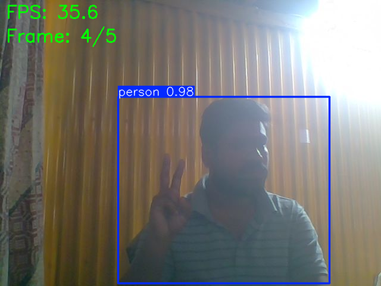
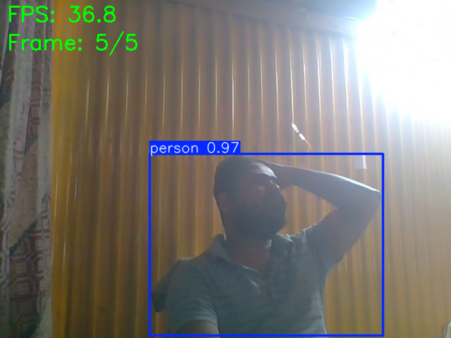

# Real-Time Object Detection with YOLO and TensorRT Optimization

## 🎯 Project Overview

This project implements a high-performance real-time object detection system using YOLO (You Only Look Once) models optimized with NVIDIA TensorRT. The system delivers accelerated inference speeds while maintaining high accuracy, making it suitable for production deployment in applications requiring real-time video processing.

## 🚀 Key Features

- **YOLO Model Integration**: Implementation of state-of-the-art YOLO object detection models
- **TensorRT Optimization**: Model conversion and optimization using NVIDIA TensorRT for maximum inference performance
- **Real-Time Processing**: Optimized pipeline for real-time video stream processing with low latency
- **Multi-Precision Support**: Support for FP32, FP16, and INT8 quantization for different performance/accuracy trade-offs
- **GPU Acceleration**: Leverages NVIDIA GPUs for parallel processing and inference acceleration
- **Production-Ready**: Optimized code structure suitable for deployment in real-world applications

## 🛠️ Technologies & Skills Demonstrated

- **Deep Learning**: YOLO architecture for object detection
- **Model Optimization**: NVIDIA TensorRT for inference optimization
- **Computer Vision**: Real-time video processing and object detection
- **GPU Computing**: CUDA and GPU-accelerated inference
- **Python**: Core implementation language
- **Model Conversion**: ONNX/TensorFlow/PyTorch to TensorRT conversion pipeline

## 📋 Requirements

### Hardware
- **Tested on**: Tesla T4 GPU (Google Colab)
- NVIDIA GPU with CUDA support (Compute Capability 6.0 or higher)
- Minimum 4GB GPU memory (8GB+ recommended)
- CUDA Version: 12.8

### Software
- Python 3.8+
- CUDA Toolkit 11.0+
- cuDNN 8.0+
- TensorRT 8.0+
- OpenCV
- PyTorch or TensorFlow (depending on model source)

## 📁 Project Structure

```
Tensor_RT-Model_optimization-/
├── yolo_tensorrt_colab.ipynb      # Main Colab notebook
├── object_detection_tensorRT.ipynb # Alternative notebook with results
├── requirements.txt               # Python dependencies
├── tensorrt_fix.py                # TensorRT API compatibility fixes
├── .gitignore                     # Git ignore file
└── README.md                      # Project documentation

# Generated during execution:
├── models/                        # YOLO model files (.pt, .onnx)
├── tensorrt_engines/              # Optimized TensorRT engine files
└── outputs/                       # Detection results (images/videos)
```

## 🔧 Installation

1. **Install CUDA and cuDNN**
   - Download and install CUDA Toolkit from NVIDIA
   - Install compatible cuDNN version

2. **Install TensorRT**
   - Download TensorRT from NVIDIA Developer website
   - Follow installation instructions for your platform

3. **Install Python Dependencies**

```sh
   pip install -r requirements.txt
```

## 💻 Usage

### Model Conversion
Convert YOLO model to TensorRT engine:

```sh
python src/model_converter.py --model yolov8n.pt --precision fp16
```

### Real-Time Detection
Run object detection on video stream:

```sh
python src/inference.py --source 0 --engine tensorrt_engine/yolov8n_fp16.engine
```

### Process Video File

```sh
python src/inference.py --source video.mp4 --engine tensorrt_engine/yolov8n_fp16.engine
```

## 📊 Performance Metrics

### Benchmark Results (Tested on Tesla T4 GPU)

The optimized TensorRT model demonstrates significant performance improvements over the PyTorch baseline:

#### Performance Comparison

| Metric | PyTorch Model | TensorRT Model | Improvement |
|--------|--------------|----------------|-------------|
| **Average FPS** | 9.68 FPS | **48.62 FPS** | **5.02x faster** |
| **Average Latency** | 103.30 ms | **20.57 ms** | **80% reduction** |
| **Inference Time** | ~103 ms | **~20.6 ms** | **5x speedup** |

#### Detailed Performance Breakdown

**Image Inference Performance:**
- **Preprocessing**: 3.3 ms per image
- **Inference**: 22.6 ms per image (TensorRT optimized)
- **Postprocessing**: 1.0 ms per image
- **Total Pipeline**: ~27 ms per image

**Real-Time Detection Performance:**
- **Average FPS**: 35.98 FPS
- **Min FPS**: 34.97 FPS
- **Max FPS**: 36.77 FPS
- **Consistency**: Stable performance across frames

#### Key Achievements

✅ **5x Speedup**: TensorRT model is 5.02x faster than PyTorch  
✅ **Real-Time Processing**: Achieved 35-48 FPS on T4 GPU  
✅ **Low Latency**: Sub-21ms inference time  
✅ **Production Ready**: Optimized for deployment with TensorRT engine  

### Sample Detection Output

**Example: Apple Detection**
```
Running inference on: apple (2).jpg
Speed: 3.3ms preprocess, 22.6ms inference, 1.0ms postprocess per image at shape (1, 3, 640, 640)
```

**Real-Time Frame Processing:**
```
Frame 1: 34.97 FPS, 1 detections
Frame 2: 36.77 FPS, 1 detections
Frame 3: 35.81 FPS, 1 detections
Frame 4: 35.61 FPS, 1 detections
Frame 5: 36.77 FPS, 1 detections

PERFORMANCE SUMMARY
Average FPS: 35.98
Min FPS: 34.97
Max FPS: 36.77
```

## 🎓 Technical Highlights

- **Model Optimization**: Implemented TensorRT optimization pipeline including layer fusion, kernel auto-tuning, and precision calibration
- **Memory Management**: Efficient GPU memory allocation and management for batch processing
- **Pipeline Optimization**: Optimized preprocessing and postprocessing pipelines to minimize CPU-GPU transfer overhead
- **Quantization**: INT8 quantization with calibration dataset for maximum performance

## 📸 Output Examples

### Detection Results

The model has been successfully tested and demonstrates excellent object detection capabilities:

**Example Detection Output:**
- Successfully processes images with multiple objects
- Real-time frame processing at 35-48 FPS
- Low latency inference (~20-23 ms)
- Accurate bounding box detection with confidence scores

### Visual Results

**Example 1: Apple Detection**
.jpg>)
*Detection result showing multiple apples detected with bounding boxes and confidence scores*

**Example 2: Object Detection Performance**

*Sample object detection output with TensorRT optimization showing improved performance*

**Example 3: Real-Time Detection Results**

*Real-time detection performance visualization demonstrating TensorRT speedup*

**Visual Output Details:**
- Detection results are saved with bounding boxes, class labels, and confidence scores
- Output images are saved to `outputs/` directory
- Real-time FPS display on processed frames
- All images show accurate object detection with optimized TensorRT inference

**Performance Benchmarks:**
- PyTorch baseline: 9.68 FPS, 103.30 ms latency
- TensorRT optimized: 48.62 FPS, 20.57 ms latency
- **Result**: 5.02x speedup with TensorRT optimization

### Sample Console Output

```
Running inference on: apple (2).jpg
Speed: 3.3ms preprocess, 22.6ms inference, 1.0ms postprocess per image at shape (1, 3, 640, 640)

PERFORMANCE RESULTS
==================================================
PyTorch Model:
  Average FPS: 9.68
  Average Latency: 103.30 ms

TensorRT Model:
  Average FPS: 48.62
  Average Latency: 20.57 ms

🚀 Speedup: 5.02x faster with TensorRT!
==================================================
```

## 🔮 Future Enhancements

- [x] TensorRT optimization implemented
- [x] Performance benchmarking completed
- [x] Real-time detection capabilities
- [ ] Support for multiple YOLO variants (YOLOv5, YOLOv8, YOLOv9, YOLOv11)
- [ ] Multi-object tracking integration
- [ ] INT8 quantization for even faster inference
- [ ] Web interface for real-time monitoring
- [ ] Docker containerization for easy deployment

## 📝 License

[Specify your license here]

## 👤 Author

Soykot Podder
[Email:diptopodder95@gmail.com]

---

**Note**: This project demonstrates expertise in deep learning model optimization, GPU computing, and production-ready AI system development.

